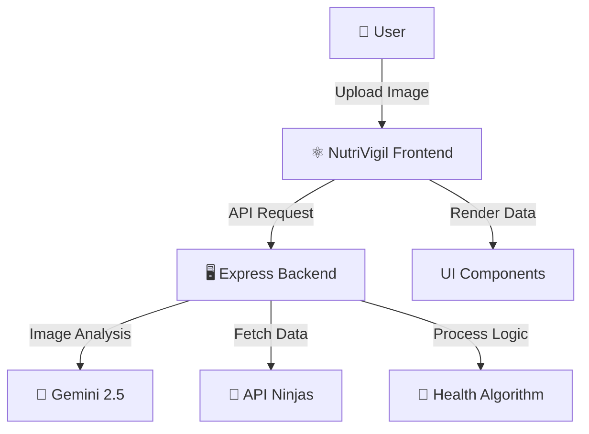

<h1 align="center">NutriVigil</h1>

<p align="center">
  
  
  
  
</p>

---

<p align="center">
  <strong>An AI-powered nutrition analysis application using the Gemini v2.5 API.</strong><br>
  <em>Educational project demonstrating the integration of Computer Vision and Large Language Models for dietary health analysis.</em>
</p>

---

<div align="center">
  
  &nbsp;
  
</div>

---

## 📂 Project Overview

NutriVigil is a full-stack web application designed to analyze food images and provide nutritional data. It leverages **Google's Gemini v2.5** for image recognition and the **API Ninjas Nutrition database** for caloric breakdown.

**Key Technical Features:**
- **AI Integration:** Implements Gemini API for food recognition from user-uploaded images.
- **Health Algorithm:** Custom logic to cross-reference food data with user health conditions (Diabetes, Hypertension, etc.).
- **Data Visualization:** Renders macro/micronutrients using responsive charts.
- **RESTful Architecture:** Express.js backend handling secure API calls and file uploads via Multer.

---

## 🛠️ Tech Stack

| Frontend                   | Backend                      | Intelligence & Data         |
|:--------------------------:|:---------------------------:|:--------------------------:|
| ⚛️ React (Vite)            | 🖥️ Node.js + Express        | 🤖 Gemini AI v2.5 (Google) |
| 🎨 Tailwind CSS            | 🗂️ Multer (File Handling)   | 🥗 API Ninjas Nutrition    |
| 🗃️ Lucide React            | 🚦 Custom Middleware         | 🔒 Axios                   |

---

## 🗺️ System Architecture


## Local Installation 
NutriVigil/
 ├─ frontend/       # React + Vite + Tailwind
 ├─ backend/        # Node.js + Express + Multer
 └─ README.md

## 🔐 Security & Environment Setup

### Required API Keys
To run this project locally, you'll need to obtain API keys from:

1. **Gemini API Key** - Google AI Studio
2. **API Ninjas Key** - API Ninjas Nutrition Database

### Environment Variables Setup

**IMPORTANT:** Never commit API keys to version control. Always use environment variables.

#### Step 1: Copy the Example Environment File

```bash
# In the backend directory
cd backend
cp .env.example .env
```

#### Step 2: Get Your API Keys

**For Gemini API:**
1. Visit [Google AI Studio](https://ai.google.dev/)
2. Click "Get API Key"
3. Create a new project or select existing one
4. Generate an API key
5. Copy the key and paste it in `.env` as `GEMINI_API_KEY`

**For API Ninjas:**
1. Sign up at [API Ninjas](https://api-ninjas.com/)
2. Go to your dashboard
3. Create a new API key
4. Copy the key and paste it in `.env` as `NINJA_API_KEY`

#### Step 3: Update Your .env File

Edit `backend/.env`:
```env
PORT=3000
NODE_ENV=development
GEMINI_API_KEY=your_actual_gemini_key_here
NINJA_API_KEY=your_actual_api_ninjas_key_here
```

#### Step 4: Verify .env is Ignored

The `.gitignore` file already includes `.env`. Verify before committing:

```bash
# Check that .env is listed in .gitignore
cat .gitignore | grep ".env"
```

### ✅ Best Practices for Security

✔️ Use `.env` files for local development (already in `.gitignore`)  
✔️ Use platform secrets for production (Render, Vercel, Docker, etc.)  
✔️ Never share or commit `.env` files  
✔️ Use `.env.example` as a template for required variables  
✔️ Rotate API keys regularly  
✔️ Restrict API key permissions in provider dashboards  

---

## Project Structure 

```

Nutrivigil/
│
├── backend/                               # Backend server handling API and AI processing
│   ├── controller/                        # Contains request handling logic
│   │   └── analyze.js                     # Main controller to analyze uploaded food images
│   │
│   ├── middleware/                        # Middleware functions for request processing
│   │   └── upload.js                      # Handles image uploads (e.g., using Multer)
│   │
│   ├── services/                          # External service integrations
│   │   └── googleservices.js              # Connects to Google Gemini / AI services
│   │
│   ├── utils/                             # Helper utility functions
│   │   ├── getmimetype.js                 # Detects MIME type of uploaded files
│   │   ├── imgconversion.js               # Converts images to required formats
│   │   └── parseGeminiJson.js             # Parses AI-generated JSON responses
│   │
│   ├── .gitignore                         # Ignores backend node_modules and env files
│   ├── index.js                           # Entry point of the backend server
│   ├── package.json                       # Backend dependencies and scripts
│   └── package-lock.json                  # Locked dependency versions
│
├── frontend/                              # Frontend React + Vite application
│   ├── src/
│   │   ├── assets/                        # Static assets like images
│   │   │   └── nutrivigile.jpeg           # App logo / banner image
│   │   │
│   │   ├── components/                    # Reusable UI components
│   │   │   ├── Footer.jsx                 # Footer component
│   │   │   ├── LanguagePicker.jsx         # Language selection component
│   │   │   ├── Navbar.jsx                 # Navigation bar component
│   │   │   └── VoiceQuery.jsx             # Voice-based food query component
│   │   │
│   │   ├── contexts/                      # React Context for global state
│   │   │   └── ThemeContext.jsx           # Manages light/dark theme
│   │   │
│   │   ├── hooks/                         # Custom React hooks
│   │   │   └── useThemeTranslation.js     # Combines theme and language logic
│   │   │
│   │   ├── i18n/                          # Multi-language translation setup
│   │   │   ├── locales/                   # Language JSON files
│   │   │   └── index.js                   # i18n configuration
│   │   │
│   │   ├── pages/                         # Application pages
│   │   │   ├── Home.jsx                   # Landing page
│   │   │   ├── Profile.jsx                # User profile page
│   │   │   └── ScanPage.jsx               # Food image scanning page
│   │   │
│   │   ├── App.jsx                        # Root React component
│   │   ├── index.css                      # Global styles
│   │   └── main.jsx                       # Frontend entry point
│   │
│   ├── index.html                         # Main HTML template
│   ├── nutrivigile.jpeg                  # Additional image asset
│   ├── package.json                       # Frontend dependencies and scripts
│   ├── package-lock.json                  # Locked dependency versions
│   ├── vite.config.js                     # Vite build configuration
│   └── .gitignore                         # Ignores frontend node_modules
│
├── .gitignore                             # Global git ignore rules
├── CODE-OF-CONDUCT.md                     # Community behavior guidelines
├── CONTRIBUTING.md                        # Contribution instructions
├── License.md                             # License information
├── MIT LICENSE.md                         # MIT license text
├── README.md                              # Project documentation
├── SECURITY.md                            # Security policy
└── package-lock.json                      # Root lock file (if present)


```
---
